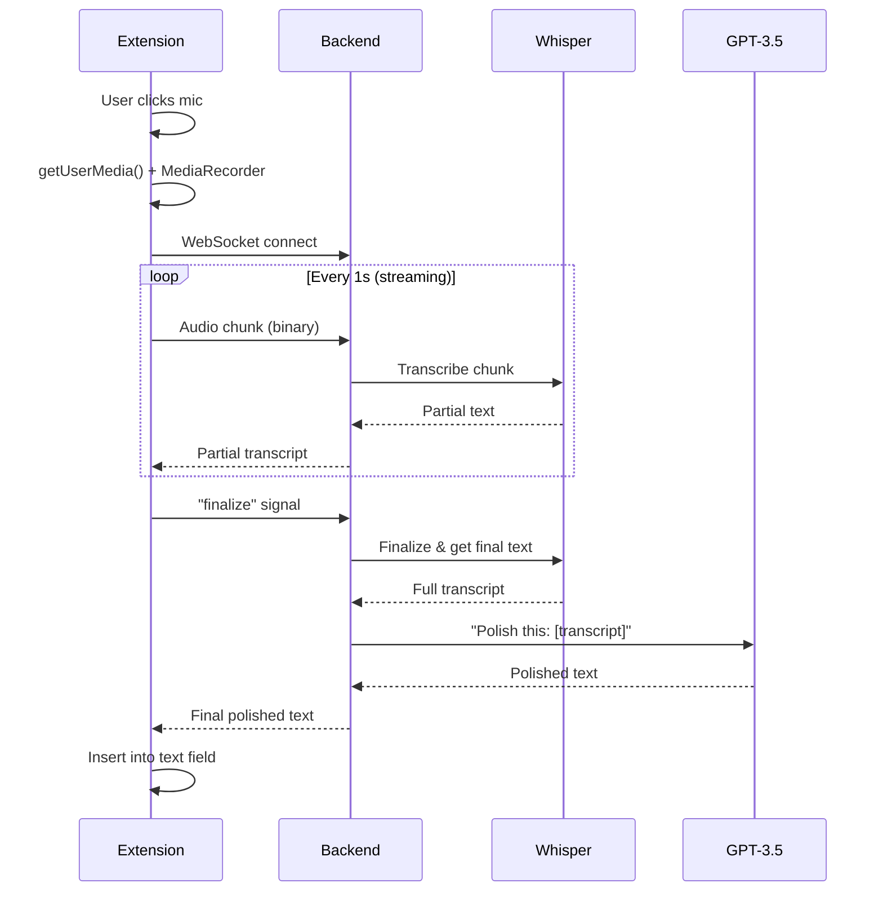

# 🎙️ Articulate — Voice-to-Polished-Text Overlay
Dictation meets AI: speak complex ideas faster, not ramble longer.
**Speak faster, write better.** A Chrome extension that automatically converts rambling speech into professional, ready-to-send text across any web application—Slack, Gmail, Jira, and beyond.


---

## 📌 Quick Overview

**Articulate** is a browser extension for software engineers that uses cutting-edge AI to turn spoken words into polished, professional writing. Click a microphone button, speak naturally (even while rambling or using technical jargon), and the system instantly transcribes your speech and cleans it up using AI—removing fillers ("um", "uh"), fixing grammar, and improving tone—then inserts the final text directly into any text field.

**Problem:** Engineers speak ~150 words per minute but only type ~40 WPM. Writing code comments, Slack messages, and Jira tickets takes time.  
**Solution:** Dictate in 2 minutes what would take 5 minutes to type—and AI polishes it along the way.

---

## ✨ Core Features

### MVP (0.1)
- **🎤 Universal Voice Capture** – Works in any web text field (Slack, Gmail, Google Docs, Jira, Notion).
- **⚡ Real-Time Transcription** – Uses OpenAI Whisper for near-human accuracy, even with technical terms.
- **🧠 AI Text Polishing** – GPT-3.5 automatically removes filler words, corrects grammar, and improves tone.
- **🎛️ Raw vs. Polish Modes** – Choose raw transcription (verbatim) or polished (AI-cleaned).
- **🔄 Streaming Audio** – Efficient chunk-based streaming for low latency (<1 second).
- **📍 Seamless Integration** – Text inserts directly into your active field—no copy/paste needed.
- **🔒 Privacy-First Design** – Optional local processing; never stores your audio.

### Coming Soon (Post-MVP)
- Multi-language & Hinglish support
- Custom tone profiles (professional/casual/technical)
- Context-aware editing (reads surrounding text)
- Offline mode (local Whisper processing)
- Desktop app support (native macOS/Windows)
- Analytics & correction learning

---

## 🏗️ Architecture

### Three-Layer System

```
┌─────────────────────────────────────────────────────────────┐
│                  BROWSER CLIENT (Extension)                  │
│  • Mic button injection & UI overlay                         │
│  • Audio capture (getUserMedia)                              │
│  • WebSocket connection to backend                           │
│  • Inserts polished text into DOM                            │
└────────────────────────┬────────────────────────────────────┘
                         │ WebSocket (binary audio + JSON)
                         ▼
┌─────────────────────────────────────────────────────────────┐
│              BACKEND SERVICE (Node.js/Python)               │
│  • WebSocket server for audio streaming                      │
│  • Orchestrates ASR & LLM calls                              │
│  • Manages buffering, VAD, retry logic                       │
│  • Implements backpressure & rate-limiting                   │
└────────────────────────┬────────────────────────────────────┘
                    ┌────┴────┐
                    ▼         ▼
        ┌──────────────────┐ ┌──────────────────┐
        │  ASR Engine      │ │  LLM Polisher    │
        │ (Whisper API)    │ │ (GPT-3.5 Turbo)  │
        │ or Local         │ │ or Local LLaMA   │
        └──────────────────┘ └──────────────────┘
```

### Data Flow



---

## 🚀 Getting Started

### Prerequisites

- **Node.js** 18+ or **Python** 3.10+
- **npm** or **yarn** (for frontend)
- **Chrome** 120+ or Chromium-based browser
- **OpenAI API Key** (for Whisper & GPT-3.5)
  - [Get one here](https://platform.openai.com/api-keys)
  - ~$1–6k/month for MVP scale (~100 daily users)

### Installation (Development)

1. **Clone the repository:**
   ```bash
   git clone https://github.com/yourusername/articulate.git
   cd articulate
   ```

2. **Setup the backend service:**
   ```bash
   cd server
   npm install
   # or if using Python:
   # pip install -r requirements.txt
   ```

3. **Configure environment variables:**
   ```bash
   cp .env.example .env
   # Edit .env and add your OpenAI API key:
   # OPENAI_API_KEY=sk-...
   # WHISPER_MODEL=small  # or 'medium', 'large'
   ```

4. **Start the backend:**
   ```bash
   npm run dev
   # Backend should run on ws://localhost:8080
   ```

5. **Load the extension in Chrome:**
   - Go to `chrome://extensions/`
   - Enable **Developer mode** (top-right)
   - Click **Load unpacked**
   - Select the `client/extension` directory from this repo
   - The extension icon should appear in your toolbar

6. **Test it out:**
   - Open any web page with a text field (try a Gmail draft, Slack workspace, etc.)
   - Click the 🎙️ icon in the text field
   - Speak a sentence: *"Hey team, um, I think we need to, uh, refactor the authentication module, right?"*
   - Watch it polish into: *"Hi team, I believe we need to refactor the authentication module."*

---

## 📁 Project Structure

```
articulate/
├── client/                        # Browser extension
│   ├── manifest.json             # Extension manifest (v3)
│   ├── content-script.ts         # Injects UI, captures audio
│   ├── background.js             # Service worker (state management)
│   ├── styles/                   # Extension UI styles
│   └── popup.html                # Settings popup
│
├── server/                        # Backend service
│   ├── src/
│   │   ├── services/
│   │   │   ├── transcriber.ts    # ASR interface & implementations
│   │   │   ├── polisher.ts       # LLM interface & implementations
│   │   │   └── websocket.ts      # WebSocket server
│   │   ├── controllers/          # Use case orchestration
│   │   ├── models/               # Data schemas (Transcript, etc.)
│   │   └── config.ts             # Environment & secrets
│   ├── server.ts                 # Entry point
│   ├── package.json
│   └── docker/                   # Docker build files
│
├── tests/                        # Test suites
│   ├── unit/                     # Unit tests (services, logic)
│   ├── integration/              # WS + API tests
│   └── e2e/                      # End-to-end (extension + backend)
│
├── docs/
│   ├── ARCHITECTURE.md           # Deep dive (same as system-design.md)
│   ├── API_REFERENCE.md          # WebSocket & REST schemas
│   └── DEPLOYMENT.md             # Docker, K8s, cloud setup
│
├── .github/workflows/            # CI/CD (GitHub Actions)
├── docker-compose.yml            # Local development stack
└── README.md                      # This file
```

---

## 🔌 API Reference

### WebSocket Protocol (Extension ↔ Backend)

**Endpoint:** `wss://api.example.com/stream`

#### Messages: Client → Server

**Audio Chunk (binary):**
```
[Raw Blob of audio data]
```
Sent as `MediaRecorder` output (~1s chunks).

**Control Message (JSON):**
```json
{
  "type": "audio_chunk",
  "seq": 1,
  "duration_ms": 1000
}
```

**Finalize (JSON):**
```json
{
  "type": "finalize"
}
```

#### Messages: Server → Client

**Partial Transcript (JSON):**
```json
{
  "type": "partial",
  "seq": 1,
  "text": "Hello wor",
  "confidence": 0.95
}
```

**Final Text (JSON):**
```json
{
  "type": "final",
  "text": "Hello world"
}
```

**Polished Text (JSON):**
```json
{
  "type": "polished_text",
  "text": "Hello, world.",
  "latency_ms": 450
}
```

**Error (JSON):**
```json
{
  "type": "error",
  "error": "quota_exceeded",
  "message": "Daily API quota exceeded. Try again tomorrow."
}
```

### REST API (Optional)

**POST `/api/polish`** – Manually polish text

```bash
curl -X POST http://localhost:8080/api/polish \
  -H "Content-Type: application/json" \
  -d '{"text": "uh hello team we need to, um, refactor things"}'
```

**Response:**
```json
{
  "polished": "Hello, team. We need to refactor.",
  "latency_ms": 320
}
```

---

## 🔧 Configuration

### Backend Environment Variables

```bash
# Core
NODE_ENV=development          # or 'production'
PORT=8080
WS_URL=ws://localhost:8080

# OpenAI
OPENAI_API_KEY=sk-...
OPENAI_MODEL=gpt-3.5-turbo

# ASR (if using Whisper API)
WHISPER_MODEL=small           # 'tiny', 'small', 'base', 'medium', 'large'
WHISPER_API_URL=https://api.openai.com/v1/audio/transcriptions

# ASR (if using local Whisper)
USE_LOCAL_WHISPER=false
WHISPER_LOCAL_MODEL_PATH=/models/ggml-small.bin

# Logging
LOG_LEVEL=info                # debug, info, warn, error
LOG_FORMAT=json               # or 'pretty'

# Rate Limiting
RATE_LIMIT_REQUESTS=100       # per minute per user
RATE_LIMIT_WINDOW_MS=60000

# Monitoring
METRICS_ENABLED=true
METRICS_PORT=9090             # Prometheus
```

### Extension Configuration

Edit [client/content-script.ts](client/content-script.ts):
```typescript
const CONFIG = {
  backend: {
    url: 'wss://api.example.com/stream',
    timeout: 5000,
  },
  ui: {
    position: 'bottom-right',    // or 'bottom-left', 'inline'
    theme: 'dark',               // or 'light'
  },
  modes: {
    defaultMode: 'polished',     // or 'raw'
    showRawOption: true,
  },
};
```

---

## 🧪 Testing & Development

### Unit Tests
```bash
cd server
npm run test:unit
```

Tests cover:
- Transcriber implementations (Whisper mocks)
- Polisher implementations (GPT mocks)
- WebSocket message parsing
- Error handling & retries

### Integration Tests
```bash
npm run test:integration
```

Runs a full flow:
1. Mock WebSocket client sends audio chunks
2. Backend processes them
3. Verify final polished text

### End-to-End Tests
```bash
npm run test:e2e
```

Uses Puppeteer/Selenium to:
1. Load extension in real Chrome
2. Click mic on test page
3. Simulate audio stream
4. Verify text insertion

### Load Testing
```bash
npm run test:load -- --users 100 --duration 60
```

Simulates 100 concurrent WebSocket sessions to stress-test backend.

---

## 📊 Metrics & Monitoring

### Key Performance Indicators (KPIs)

| Metric | Target | Current |
|--------|--------|---------|
| **Latency (end-to-end)** | <1000ms | — |
| **ASR latency** | <500ms | — |
| **LLM latency** | <400ms | — |
| **Availability** | 99.9% | — |
| **Error rate** | <1% | — |
| **Word Error Rate (WER)** | <5% | — |

### Observability

**Prometheus Metrics** (exposed on `:9090/metrics`):
```
articulate_transcription_latency_ms  # Histogram
articulate_polishing_latency_ms      # Histogram
articulate_websocket_connections     # Gauge
articulate_requests_total            # Counter (by status)
articulate_errors_total              # Counter (by type)
```

**Logging** (JSON structured logs to stdout/file):
```json
{
  "timestamp": "2026-05-09T10:23:45.123Z",
  "level": "info",
  "event": "transcription_complete",
  "user_id": "user_123",
  "transcript": "Hello world",
  "latency_ms": 450,
  "session_id": "sess_abc"
}
```

**Alerting** (example thresholds):
- End-to-end latency >2s → Page error
- Error rate >5% → Critical alert
- WebSocket connection drop → Warning

---

## 🔒 Privacy & Security

### Privacy Guarantees

✅ **Audio is never stored** – Transcription happens once, then deleted.  
✅ **No user identification** – Extension doesn't send usernames, email, or cookies.  
✅ **Encrypted in transit** – All data uses TLS (wss://, https://).  
✅ **Optional local mode** – Process audio entirely on your device (coming soon).  
✅ **GDPR/CCPA compliant** – See [Privacy Policy](docs/PRIVACY.md).

### Consent & Transparency

On first use, the extension shows:
> **Articulate wants to use your microphone.** Your voice will be processed by our servers to transcribe and polish your text. We never store your audio. [Learn more](https://articulate.dev/privacy)

Users can:
- ✅ Enable/disable per website
- ✅ Choose local or cloud processing
- ✅ Request data deletion anytime

### Security Practices

- 🔑 **API Keys** stored only as env vars (never in code)
- 🛡️ **CSP headers** prevent XSS in extension
- 🔍 **Input sanitization** of transcripts before LLM
- 📋 **Minimal logging** (no sensitive data)
- 🔐 **TLS 1.3+** for all connections
- 🚨 **Dependency scanning** via GitHub's Dependabot
- 🔎 **Regular security audits** (internal & 3rd-party)

See [Security Policy](docs/SECURITY.md) for vulnerability reporting.

---

## 📈 Roadmap

### Phase 1: MVP (May–June 2026)
- [x] Extension UI & audio capture
- [x] WebSocket backend
- [x] Whisper ASR integration
- [x] GPT-3.5 polishing
- [x] Slack/Gmail support
- [ ] Launch beta (invite-only)

### Phase 2: Polish & Stability (July 2026)
- [ ] Performance optimization (latency <500ms)
- [ ] Error handling & user-friendly messages
- [ ] Extension marketplace listing
- [ ] Public launch 🚀

### Phase 3: Expansion (Aug–Oct 2026)
- [ ] Multi-language support (Hindi, Spanish, etc.)
- [ ] Local Whisper mode (privacy)
- [ ] Custom tone profiles (professional/casual)
- [ ] Context-aware editing
- [ ] Desktop app (Electron)

### Phase 4: Enterprise (Q4 2026+)
- [ ] Team analytics & reporting
- [ ] Custom vocabulary training
- [ ] API for 3rd-party integrations
- [ ] Self-hosted option

---

## 🎯 Model & Cost Comparison

| Component | Option | Accuracy | Latency | Cost |
|-----------|--------|----------|---------|------|
| **ASR** | OpenAI Whisper API | ⭐⭐⭐⭐⭐ | ~real-time | $0.017/min【40】 |
| | Google Cloud STT | ⭐⭐⭐⭐⭐ | ~real-time | $0.016/min【44】 |
| | Local Whisper | ⭐⭐⭐⭐⭐ | 0.5–2x real-time | Free (GPU cost) |
| **LLM** | GPT-3.5 Turbo | ⭐⭐⭐⭐⭐ | ~instant | $0.002/1K tokens【60】 |
| | GPT-4 | ⭐⭐⭐⭐⭐ | ~instant | ~$0.03/1K tokens |
| | Local Llama 3 | ⭐⭐⭐⭐ | seconds | Free (GPU cost) |

**Estimated Monthly Cost (100 active users, 10 min/day):**
- ASR: ~$170/day → **$5,100/month**
- LLM: ~$20/day → **$600/month**
- **Total: ~$5,700/month** (cloud) or ~$2–3k/month (self-hosted GPU)

---

## 📖 Documentation

- **Architecture Deep Dive** — Detailed system design
- **API Reference** — WebSocket & REST specs
- **Deployment Guide** — Docker, Kubernetes, cloud providers
- **Contributing Guide** — How to contribute code
- **Privacy Policy** — Data handling & compliance
- **Security Policy** — Reporting vulnerabilities

---

## 🤝 Contributing

We welcome contributions! Please see CONTRIBUTING.md for guidelines.

### Quick contribution steps:
1. Fork the repo
2. Create a feature branch: `git checkout -b feat/awesome-feature`
3. Make changes and add tests
4. Submit a PR with a clear description

### Code style:
- TypeScript with ESLint rules
- Follow SOLID principles
- Tests required for new features (>80% coverage)

---

## 📄 License

MIT License © 2026 Articulate Contributors.  
See LICENSE for details.

---

## 💬 Support & Community

- **Issues:** [GitHub Issues](https://github.com/yourusername/articulate/issues)
- **Discussions:** [GitHub Discussions](https://github.com/yourusername/articulate/discussions)
- **Email:** support@articulate.dev
- **Twitter:** [@ArticulateApp](https://twitter.com/ArticulateApp)

---

## 👥 Team & Credits

**Founders:**
- You (@yourusername)

**Core Contributors:**
- Frontend: [Name]
- Backend: [Name]
- ML/DevOps: [Name]

**Special thanks to:** OpenAI (Whisper), Anthropic (Claude), and the open-source community.

---

## 🎓 Acknowledgments

Built with:
- [OpenAI Whisper](https://github.com/openai/whisper) — ASR
- [OpenAI GPT-3.5](https://openai.com/api/) — LLM polishing
- [Chrome WebSocket API](https://developer.chrome.com/docs/extensions/mv3/)
- [MediaRecorder API](https://developer.mozilla.org/en-US/docs/Web/API/MediaRecorder)
- [Node.js](https://nodejs.org/)

---

**Made with ❤️ to help engineers write faster.**
```

---

This README combines:
- **From plan.md:** Product vision, features, competitive landscape, target users, go-to-market, costs
- **From system-design.md:** Architecture diagrams, technical stack, API schemas, infrastructure, configuration, testing, privacy

**Key sections included:**
✅ Quick overview  
✅ Features (MVP + roadmap)  
✅ Architecture with diagrams  
✅ Getting started guide  
✅ Project structure  
✅ API reference (WebSocket & REST)  
✅ Configuration  
✅ Testing strategy  
✅ Metrics & monitoring  
✅ Privacy & security  
✅ Roadmap  
✅ Model comparison & costs  

You can now copy this entire content and save it as `README.md` in your project root!
