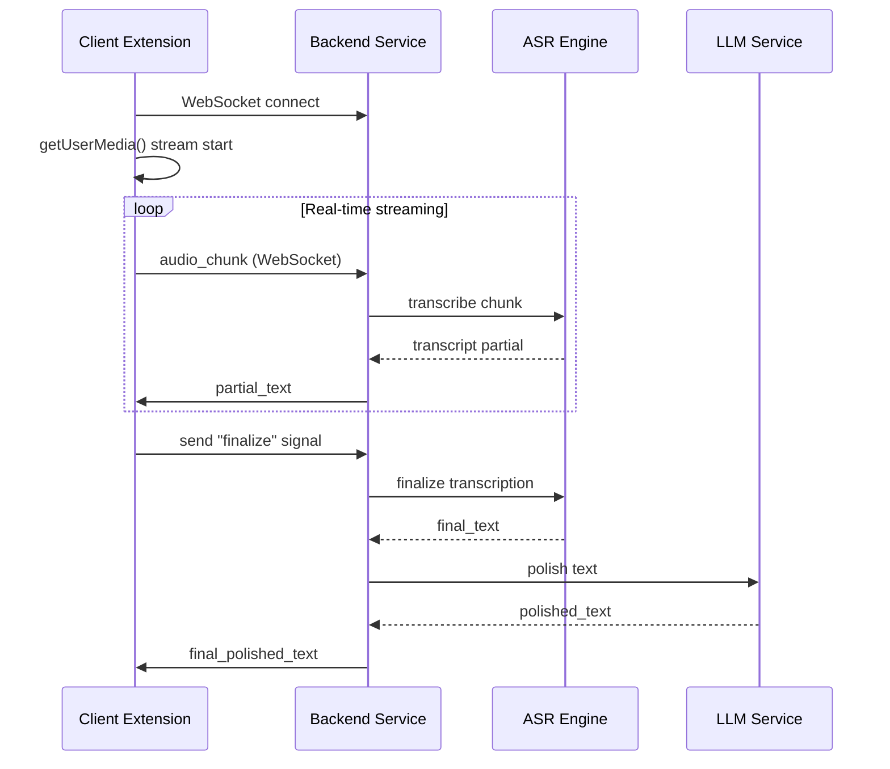
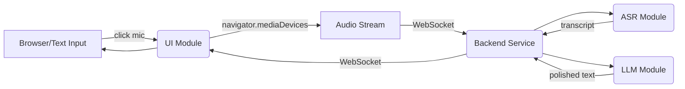
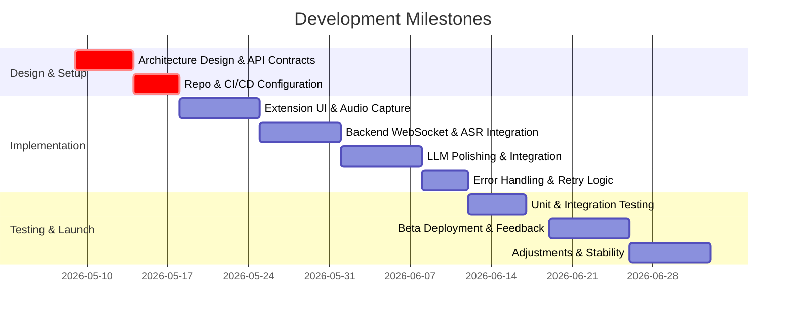

# Voice-to-Text Polished Overlay: System Design and Developer Runbook

**Executive Summary:** We will build a browser/desktop extension (“Voice Overlay”) that lets users speak in any text field (e.g. Slack, Gmail, Jira) and automatically transcribes and AI-polishes the speech into well-formed text. The system comprises a client-side extension (Manifest V3) and a backend service for ASR (speech-to-text) and LLM-based polishing. Audio is captured via `getUserMedia` (with MediaRecorder/VAD), streamed to a server over WebSockets, transcribed by a model like Whisper or Google STT, then passed to an LLM (e.g. GPT-3.5) for cleaning filler words and grammar.  We enforce secure, consent-driven capture and optional local processing for privacy. This runbook covers end-to-end architecture, SOLID decomposition, APIs, protocols, code examples (TS/JS/Python), Docker/CI notes, infra diagrams, data schemas, auth, logging, testing, metrics, rollout plan, and GDPR/CCPA compliance checklists.  Key trade-offs (model accuracy/latency/cost, streaming choices) are tabulated.  This is an exhaustive developer guide for the MVP.

## System Architecture & Data Flow

Our architecture has **three layers**: (1) *Client Extension* (browser plugin or desktop helper), (2) *Streaming Backend Service*, and (3) *AI Processing Layer*. In the browser, a content script injects a mic button into text inputs. On activation, it calls `navigator.mediaDevices.getUserMedia({audio:true})`【58†L376-L384】【62†L458-L462】 and streams audio chunks to our backend (via WebSocket). The backend buffers and decodes audio, sends chunks to ASR (Whisper or Google STT) for partial transcripts, then on end-of-input requests LLM polishing. The polished text is sent back and inserted into the input field. The flow is:



Each component runs as a separate module/service to respect **SOLID/clean architecture**. The Extension UI (single responsibility for capturing audio and inserting text) never directly calls models. The ASR and LLM logic are encapsulated in service interfaces (e.g. `ITranscriber`, `IPolisher`) so we can swap providers easily. Data flows use explicit contracts (see below).

**Mermaid Diagram:** 



## Client Extension (Manifest V3)

The extension’s **Manifest V3** defines a content script and an optional background worker:

```json
{
  "manifest_version": 3,
  "name": "Voice Overlay",
  "version": "0.1",
  "permissions": ["storage", "activeTab"], 
  "host_permissions": ["https://*/","http://*/"],
  "background": {
    "service_worker": "background.js"
  },
  "content_scripts": [
    {
      "matches": ["<all_urls>"],
      "js": ["content-script.js"],
      "run_at": "document_idle"
    }
  ],
  "web_accessible_resources": [{ "resources": ["inject.css"], "matches": ["<all_urls>"] }]
}
```
【56†L202-L210】.  
Key points:
- **Content Script:** Injects UI elements (microphone button) into input fields on matching pages (e.g. Slack, Gmail).
- **Permissions:** Use `activeTab` or specific host patterns. `navigator.mediaDevices.getUserMedia()` does **not** require a special extension permission, just a secure context【62†L458-L462】. We declare `"activeTab"` to interact with current page.
- **Background/Service Worker:** Handles long-running tasks and messaging if needed (e.g. OAuth token refresh).
- **Content Security Policy:** Ensure extension can use WebSocket (include `wss://` in `connect-src` in CSP if strict).

### Content Script (content-script.js)

- **Inject UI:** On page load or focus, detect text fields (`<input>`, `<textarea>`, contentEditable) and append a mic icon (📢).
- **Event Handlers:** On icon click, start/stop recording. Show status (e.g. red dot while listening).
- **Audio Capture:** Use `navigator.mediaDevices.getUserMedia({audio:true})`【58†L376-L384】 in response to user click (requires user gesture to show permission dialog). 
- **MediaRecorder:** Start `MediaRecorder(stream)` to emit data periodically (e.g. every 1s)【58†L376-L384】【58†L410-L419】. For each `ondataavailable`, send the `Blob` via WebSocket to backend.
- **WebSocket:** Establish a single WebSocket connection (or reuse existing). Send audio blobs as binary or Base64 JSON (see API schema).
- **Handling Responses:** On receiving partial/final transcripts from backend, insert or update the input field content using DOM APIs (e.g. `element.value = text` or for contentEditable, `execCommand('insertText', false, text)`).
- **Retry Logic:** If WebSocket drops, attempt reconnect with backoff. Buffer any unsent audio in memory and resend after reconnect.
- **Example snippet (TS/JS):**

```typescript
// content-script.js (simplified)
const micButton = document.createElement('button');
micButton.textContent = '🎙️';
document.body.appendChild(micButton);

let mediaRecorder: MediaRecorder, ws: WebSocket;

micButton.onclick = async () => {
  if (!mediaRecorder) {
    const stream = await navigator.mediaDevices.getUserMedia({ audio: true });
    mediaRecorder = new MediaRecorder(stream);
    ws = new WebSocket("wss://api.example.com/stream"); // connect to backend
    mediaRecorder.ondataavailable = e => {
      if (ws.readyState === WebSocket.OPEN) {
        ws.send(e.data);
      }
    };
    mediaRecorder.start(1000); // chunk every 1s
    micButton.textContent = '⏹️ Stop';
  } else {
    mediaRecorder.stop();
    micButton.disabled = true;
    ws.send(JSON.stringify({ event: "finalize" }));
  }
};

ws.onmessage = e => {
  const msg = JSON.parse(e.data);
  if (msg.type === 'polished_text') {
    insertTextIntoActiveField(msg.text);
    micButton.textContent = '🎙️';
    micButton.disabled = false;
  }
};
```

### Background/Service Worker

- Not strictly needed for core audio, but useful for OAuth or persistent state. Use it to coordinate messages if multi-tab.
- Can manage an `chrome.identity` OAuth flow (if using Google login) or store user tokens.

## Desktop Accessibility Helper (Optional)

To support non-browser apps (Slack Desktop, native editors), we can later add a small helper (Electron or Python script) that listens for a global hotkey and performs similar capture. It could use OS APIs (e.g. on Windows UI Automation or macOS Accessibility) to insert text. This is advanced and out-of-scope for MVP, but note design should allow switching to a native injector component. We would treat it as a separate client that uses the same WebSocket/ASR backend.

## Audio Capture, Buffering & VAD

### getUserMedia and MediaRecorder

The extension uses the standard Web API to capture microphone audio in a secure context【62†L458-L462】. The user must click the mic icon (triggering getUserMedia) to grant permission. Example pattern:

```js
const stream = await navigator.mediaDevices.getUserMedia({ audio: true });
const recorder = new MediaRecorder(stream);
recorder.start(1000); // get 1s chunks
recorder.ondataavailable = (evt) => {
  // evt.data is a Blob of audio (e.g. Opus/webm)
  websocket.send(evt.data);
};
```

【58†L376-L384】【62†L458-L462】 MDN shows this typical usage. We ensure `MediaRecorder` is supported (fallback to AudioContext streaming if needed). We set `recorder.interimResults = true` for continuous flow.

### Voice Activity Detection (VAD)

To avoid sending silence, we implement a simple VAD: after receiving a chunk, measure its volume (via Web Audio API) and drop if below threshold, or keep sending but label silence. Alternatively, stop MediaRecorder on silence and restart on voice. A library (e.g. Porcupine/VAD) could help. For MVP, we may skip VAD and rely on user to stop recording; any silence just transcribes to empty text.

### Chunking and Retry

Audio is sent in fixed-duration chunks (1-2 sec). If network issues occur, we buffer the unsent Blobs in a queue and retry sending upon reconnect. We tag each chunk with a sequence number. On the server, missing sequence or gaps can trigger a request to retransmit or skip gracefully.

## Backend Service & API Contracts

The backend is a TCP WebSocket (or HTTP streaming) server that receives audio chunks and returns transcripts. We define a JSON/WS protocol:

- **WebSocket Endpoint:** `wss://api.example.com/stream`
- **Message Schema (client -> server):** For binary audio, we send raw bytes (or Base64 with JSON envelope). Example JSON envelope:

  ```json
  { "type": "audio_chunk", "seq": 12, "data": "<binary_audio_base64>" }
  ```
- **Server Acknowledgement:** Immediately return a partial text:

  ```json
  { "type": "partial_text", "seq": 12, "text": "Hello wor" }
  ```
  (providing incremental transcript for chunk 12).  
- **Finalize:** Client sends `{ "type": "finalize" }` after stopping recording.  
- **Server Reply (final transcript):**

  ```json
  { "type": "final_text", "text": "Hello world, team." }
  ```

- **Polishing (HTTP API or WS):** After final transcript, client may call an HTTP endpoint `/polish` with `{text: "..."}`
  to get refined:  
  ```json
  POST /api/polish
  { "text": "Hello world, team." }
  ```
  Response: `{ "polished": "Hello, team." }`.  
  Alternatively, the server can automatically polish and send via WS with type `polished_text`.

**Example WebSocket message handling (Node.js pseudo):**

```js
wss.on('connection', ws => {
  let buffer = [];
  ws.on('message', async data => {
    const msg = JSON.parse(data);
    if (msg.type === 'audio_chunk') {
      // decode Base64->Buffer if needed
      buffer.push(msg.data);
      const transcript = await asr.transcribeChunk(msg.data);
      ws.send(JSON.stringify({type:'partial_text', seq: msg.seq, text: transcript}));
    }
    else if (msg.type === 'finalize') {
      const fullAudio = mergeBuffers(buffer);
      const text = await asr.transcribe(fullAudio);
      const polished = await llm.polish(text);
      ws.send(JSON.stringify({ type: 'final_polished_text', text: polished }));
      buffer = [];
    }
  });
});
```

We employ backpressure control using WebSocket streams (MDN notes that raw `WebSocket` has no backpressure【70†L212-L220】). To handle high-load safely, we can use the `WebSocketStream` interface (Promise-based Streams API) which supports `WritableStream` backpressure【70†L212-L220】, but for MVP we may manage manually (e.g. pause reading from client if queue grows).

## ASR Integration

We compare ASR options:

| ASR Engine          | Mode         | Latency      | Accuracy           | Cost                | On-Device |
|---------------------|--------------|--------------|--------------------|---------------------|-----------|
| OpenAI Whisper API  | Cloud/Streaming | ~real-time | Very high (multilingual) | $0.017/min (API)【40†L124-L132】 | No (cloud) |
| OpenAI Whisper (local) | Local (GPU) | 0.5–1x real-time (GPU) | Very high | Free (compute cost) | Yes (needs GPU) |
| Google Cloud STT    | Cloud API    | ~real-time   | Very high          | $0.016/min【44†L45-L53】 | No |
| Web Speech API      | Browser-Cloud | ~instant   | Medium (English)   | Free               | Partial (Chrome) |
| Mozilla DeepSpeech  | Local        | ~2–5x real-time (CPU) | Medium-High     | Open-source      | Yes |
| Vosk (offline)      | Local        | moderate     | Medium            | Free (local)        | Yes |

For MVP, we use **OpenAI Whisper** via API for best accuracy and simplicity, with optional local Whisper as fallback to improve privacy. Whisper can be invoked via their HTTP API or by running Python server. Example (Python):

```python
import whisper
model = whisper.load_model("small")
result = model.transcribe("input.wav")
print(result["text"])
```
【64†L436-L441】.  
For streaming, we send audio chunks to the API. Alternatively, use `whisper.cpp` (Wasm) in-browser for basic fallback.

We support multiple languages as needed (Whisper identifies languages and can translate if configured). For this dev-runbook, we assume English input; codebase can be extended for multilingual.

## LLM Polishing Pipeline

After ASR final text, we pass it to an LLM to clean it up. Options:

| Model          | Provider/Type | Context | Latency | Cost (per 1K tokens)  | Notes            |
|----------------|---------------|---------|---------|-----------------------|------------------|
| GPT-3.5 Turbo  | OpenAI API    | 4k tokens| ~instant | $0.0005 input, $0.0015 output【60†L13-L16】 ($0.002 combined) | High-quality text |
| GPT-4          | OpenAI API    | 8k tokens| ~instant | $0.03 output (est) | Better style understanding |
| Claude 3       | Anthropic API | ~100k   | ~instant | (varies)             | Good for complex edits |
| Llama 3 70B    | Local         | 32k tokens| sec    | Free (host cost)     | Self-host if GPU available |
| Mistral 7B     | Local         | 8k tokens | sec    | Free (host cost)     | Lightweight        |

For MVP, we use OpenAI GPT-3.5 (turbo) via API due to ease. Prompt template example:

```
Prompt: "Revise the following spoken text into clear, well-formed writing. Remove fillers and correct grammar:\n\n\"{transcript}\""
```

We handle hallucination by instructing LLM: e.g. "Do not add new information." If needed, include a few-shot example of "um" removal. We also quote the transcript in prompt.

**Example HTTP API (Node/Python):**

```js
// Node.js using openai npm
const { Configuration, OpenAIApi } = require("openai");
const config = new Configuration({ apiKey: process.env.OPENAI_KEY });
const ai = new OpenAIApi(config);

async function polishText(raw) {
  const prompt = `Polish this text: "${raw}". Remove filler words and errors.`;
  const res = await ai.createChatCompletion({
    model: "gpt-3.5-turbo",
    messages: [{ role: "user", content: prompt }],
  });
  return res.data.choices[0].message.content.trim();
}
```

【64†L436-L441】 (shows using `whisper.load_model`). 
No direct LLM official docs cited, but [60†L13-L16] provides cost.

## Caching, Rate-Limiting, Backpressure

- **Caching:** We can cache frequent user phrases or language models in memory for speed, but audio varies a lot so caching transcripts is low-value. Possibly cache token prefixes for LLM API cost reduction.
- **Rate-Limiting:** Enforce API quotas to avoid abuse (e.g. 100 requests/min per user). Use a token bucket or external service (e.g. Redis).
- **Backpressure:** For WebSocket, use `WebSocketStream` (MDN) to handle backpressure【70†L212-L220】. In Node, use `ws` with `socket.send()` and check `socket.bufferedAmount`. If too high, pause MediaRecorder momentarily until drained.

## Code Architecture (SOLID)

We structure code with clear layers:

- **Entities:** `AudioChunk`, `Transcript`, `PolishedText`.
- **Interfaces (TypeScript):** 
  ```ts
  interface ITranscriber {
    transcribeChunk(data: ArrayBuffer): Promise<string>;
    finalizeTranscription(): Promise<string>;
  }
  interface IPolisher {
    polish(text: string): Promise<string>;
  }
  ```
- **Services:** `WhisperTranscriber` implements `ITranscriber` using Whisper; `GPTPolisher` implements `IPolisher` calling OpenAI API.
- **Use Cases:** `TranscribeUseCase` and `PolishUseCase` that orchestrate calls and handle retries/errors.
- **UI/Controller:** `AudioController` (content script) handles user events and sends audio to backend; `ExtensionController` (background worker) may manage state if needed.
- **Dependency Injection:** The backend can inject either real or mock `ITranscriber`/`IPolisher` for testing.
- Each class has single responsibility (e.g. `WebSocketService` only handles WS comms).

Example class (Node/TypeScript):

```ts
class WhisperTranscriber implements ITranscriber {
  async transcribeChunk(data: ArrayBuffer): Promise<string> {
    // call Whisper API or local service
    // e.g. send POST /whisper/stream
  }
  async finalizeTranscription(): Promise<string> {
    // optionally call finalization endpoint
  }
}
class GPTPolisher implements IPolisher {
  async polish(text: string): Promise<string> {
    // call OpenAI chat completion with text
  }
}
```

## API/Message Schemas

**WebSocket Messages (extension ↔ backend):**

- **Client->Server (binary):** raw audio chunks (PCM or Opus in Blob form). Use `WebSocket.send(Blob)`.
- **Server->Client (JSON):** partial transcripts, final polished text.
  ```json
  { "type": "partial", "seq": 10, "text": "Hello wor" }
  { "type": "final", "text": "Hello world!" }
  ```
- **HTTP API (optional):** POST `/api/polish`: `{ "text": "raw text" }` -> `{ "polished": "clean text" }`.

**Database (Telemetry) Schema Example:**

For basic analytics:

```sql
CREATE TABLE transcripts (
  id SERIAL PRIMARY KEY,
  user_id VARCHAR,
  transcript TEXT,
  polished TEXT,
  created_at TIMESTAMP DEFAULT NOW(),
  latency_ms INT,
  success BOOLEAN
);
```

We log each final result with timestamps and processing time. Use a simple relational DB (PostgreSQL) or analytics store.

## Infrastructure, Deployment & CI/CD

### Docker

- **Backend Dockerfile (Node or Python):** Contains the service (ASR+LLM clients). Example for Node:

  ```dockerfile
  FROM node:18-alpine
  WORKDIR /app
  COPY package.json yarn.lock ./
  RUN yarn install --production
  COPY . .
  EXPOSE 8080
  CMD ["node", "server.js"]
  ```
- **Python for Whisper:** If using Python, base on `python:3.11-slim`, pip install `openai-whisper`.

We push Docker images to a registry (Docker Hub or AWS ECR).  

### CI/CD

- Use GitHub Actions/GitLab CI for linting, testing, and Docker build. Example steps: install deps, run `eslint`/`pytest`, build image, push to registry.
- Deploy backend to cloud: options include Kubernetes (GKE/EKS), AWS ECS, or even serverless (Lambda + API Gateway for small loads). Whisper on GPU likely needs EC2 or managed GPU service.

### Infrastructure

- **Compute:** 
  - If using Whisper locally, use a GPU-enabled VM (e.g. AWS p3.xlarge, ~$3/hr) or TPU. 
  - Alternatively, use Whisper API (no infra for ASR, just backend to call it).
  - LLM via OpenAI (no hosting needed), or host Llama on similar GPU.
- **Database:** Hosted RDS or managed SQL (AWS RDS).
- **WebSocket Service:** Node behind NGINX (with `wss`).
- **Load Balancing:** If scaling, use a load balancer for WebSockets.

### Cost Estimate (MVP scale)

- **OpenAI Whisper API:** ~$0.017/min【40†L124-L132】. 
- **OpenAI GPT-3.5 API:** ~$0.002 per 1K tokens【60†L13-L16】. 
- **Compute (if self-host):** g4dn.xlarge GPU ~$0.52/hr on AWS, enough for ~real-time Whisper-small. 
- **Bandwidth:** Negligible for audio chunks.
- **Monthly:** For 1000 users averaging 10 min/day: ~1000*10*$0.017 = $170/day → $5k/month on ASR; plus GPT cost (~$20/day) → ~$6k/month. With smaller usage, ~$1k/mo.

## Authentication & Secrets

- **Auth:** If extension needs user identity (to save settings or access workspace), implement OAuth2 (e.g. with Google Identity). Use `chrome.identity.launchWebAuthFlow` for user login, store tokens in `chrome.storage`.
- **API Keys:** If using OpenAI/Google, store API keys as environment variables or in a secrets manager. Never hard-code in code.
- **Permissions:** Follow Principle of Least Privilege. E.g. request only mic access, not camera. **HTTPS only:** ensure extension/CSP loads backend via wss.
- **Manifest Permissions:** `{"permissions": ["identity", "storage"], "oauth2": {...}}` if using OAuth.
- **Consent:** On first use, show a banner explaining audio data use (for compliance).

## Logging & Observability

- **Logging:** Use structured logs (JSON) with timestamps. Fields: userID, event (start, stop, error), latency. Send logs to a central system (e.g. CloudWatch, ELK).
- **Metrics:** Instrument: 
  - Latency (response time) for ASR and LLM.
  - Error rate (transcription failures).
  - Throughput (#requests/s).
  - System load (CPU/GPU).
  - SLO Targets: e.g. 95% of transcripts < 500ms, 99% LLM < 1s.
- **Monitoring:** Use Prometheus/Grafana or cloud monitoring. Set alerts for high error rates or latency.
- **Observability:** Correlate audio chunks by session ID. Log stack traces on exceptions.

## Testing Strategy

- **Unit Tests:** 
  - Content script logic (mock MediaRecorder, simulate clicks).
  - Backend functions (mock Whisper/LLM outputs).
- **Integration Tests:** 
  - Run backend service and simulate a full WS session (send a prerecorded audio file, verify final text).
- **End-to-End Tests:** 
  - Use Selenium or Puppeteer to load a Chrome profile with the extension, click mic on a test page, feed synthetic audio, and check result in field.
- **Load Testing:** 
  - Using tools like k6 or JMeter: simulate many concurrent WebSocket connections sending audio to ensure backend scales. 
- **Test Data:** Use sample audio clips in test suite to verify transcription accuracy.

## Metrics & KPIs

- **Accuracy Metric:** Word Error Rate (WER) measured on a validation set.
- **Speedup:** Compare time-to-text vs manual typing (user study).
- **Adoption:** % of users toggling voice mode; retention of users.
- **Reliability:** 99.9% uptime, <1% fail rate (transcription failure).
- **Latency:** Average TTF (text from speech) < 1s.

## Rollout Plan

1. **Alpha (Internal):** Test core audio->text->insert in trusted environment (company devices). Fix critical issues.
2. **Beta (Invite-only):** Release to select teams. Collect feedback, monitor logs/metrics. 
3. **Canary:** Deploy to small % of production users. Gradually increase.
4. **General Launch:** After meeting SLOs and eliminating major bugs.

Use feature flags (Chrome extension can update silently, but you may control server features via flags).

## Privacy & Compliance

- **User Consent:** On install/first use, show a consent screen stating audio is captured and processed. 
- **Local Mode:** Offer an option to use local ASR (whisper.cpp in browser or a local binary), so audio never leaves the device.
- **GDPR/CCPA Checklist:** 
  - Minimize data collection (only current session audio).
  - Encrypt data in transit (use wss/TLS) and at rest (if storing logs).
  - Provide data access/deletion on request. 
  - Don’t store identifiable info: drop IP, anonymize transcripts if stored.
- **Security Controls:** 
  - Use CSP in extension to prevent XSS.
  - Sanitize transcripts (avoid running untrusted code).
  - Review dependencies for vulnerabilities.
  - Regular security reviews and pen-tests.

## Development Tasks & Timeline

### Tasks
- **Design:** Finalize API schemas, component interfaces.
- **Setup Repo & CI:** Initialize monorepo with `client/` and `server/` directories. Configure CI (GitHub Actions) for linting/tests.
- **Extension Scaffold:** Create `manifest.json`, content script and background worker templates. Implement UI injection.
- **Audio Capture:** Integrate `getUserMedia` + `MediaRecorder`. Test chunk capture.
- **WebSocket Protocol:** Build WS client in extension, server skeleton (Node/Python).
- **ASR Service:** Connect Whisper API or local whisper. Implement chunk transcription.
- **LLM Service:** Implement OpenAI GPT call for polishing.
- **Integration:** Wire WebSocket events to ASR and LLM, send final text back.
- **Error Handling:** Add retry/backoff, user notifications on failure.
- **Testing:** Write unit and integration tests.
- **Observability:** Add logging/metrics hooks.
- **Infra:** Write Dockerfile, deploy on test environment.
- **Iteration:** Improve based on tests.

### Timeline (Gantt):



### Team Roles
- **Frontend Developer:** Builds Chrome extension (TS/JS) and UI.
- **Backend Developer:** Implements Node/Python services (WebSocket, ASR/LLM integration).
- **ML Engineer:** Tunes ASR/LLM prompts, sets up Whisper/GPU if on-prem.
- **DevOps:** Configures CI/CD, deployment (Docker, Kubernetes).
- **QA Engineer:** Writes tests, performs E2E and load testing.
- **Security/Privacy Officer:** Ensures GDPR compliance.

## Tables: Model and Protocol Trade-offs

**ASR Models:**

| Model           | Deployment   | Accuracy    | Latency      | Cost (approx)        | On-Device Feasible |
|-----------------|--------------|-------------|--------------|----------------------|--------------------|
| Whisper (large) | Self-host/GPU| Very high   | 0.5–1x real-time (GPU) | Free (but GPU cost) | Yes (GPU req)      |
| Whisper API     | Cloud        | Very high   | Real-time    | ~$0.017/min【40†L124-L132】 | No             |
| Google STT      | Cloud        | Very high   | Real-time    | ~$0.016/min【44†L45-L53】 | No             |
| Web Speech API  | Browser      | Med-High    | ~instant    | Free                | Partial (Chrome only) |
| Vosk (medium)   | Local        | Medium      | ~2x real-time| Free                | Yes               |

**LLM Models:**

| Model           | Provider/Type | Context Window | Latency   | Cost (1k tokens)          | Notes            |
|-----------------|---------------|----------------|-----------|---------------------------|------------------|
| GPT-3.5 Turbo   | OpenAI API    | 4k tokens      | ~instant  | $0.002 (input+output)【60†L13-L16】 | High quality     |
| GPT-4           | OpenAI API    | 8k tokens      | ~instant  | ~$0.03 (out)             | Best quality    |
| Claude 3        | Anthropic API | ~100k tokens   | ~instant  | (varies)                 | Large context   |
| Llama 3 70B     | Local         | 32k tokens     | seconds   | Free (hosting cost)      | Requires GPU    |
| Mistral 7B      | Local         | 8k tokens      | seconds   | Free                     | Lightweight     |

**Streaming Protocols:**

| Protocol        | Bi-directional | Supports Audio | Backpressure | Notes                    |
|-----------------|----------------|----------------|--------------|--------------------------|
| WebSocket       | Yes            | Yes            | No【70†L212-L220】   | Widely supported; use WebSocketStream API for backpressure【70†L212-L220】 |
| WebSocketStream | Yes            | Yes            | Yes         | Uses Streams API, easier backpressure【70†L212-L220】 |
| WebRTC (Data Channel) | Yes      | Yes            | Partial     | Complex setup, P2P focus |
| HTTP Chunking   | No (client push only) | Yes     | N/A         | Simpler but high latency (each chunk separate HTTP) |

## Citations

- OpenAI Whisper repo and docs【64†L323-L330】【64†L436-L441】.
- Chrome extension manifest/docs【56†L202-L210】.
- MDN Web Speech and Media APIs【54†L209-L212】【58†L376-L384】【62†L458-L462】【70†L212-L220】.
- OpenAI pricing example【60†L13-L16】.

